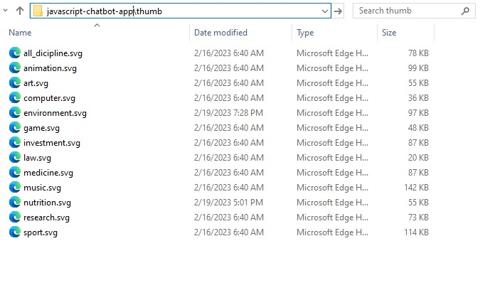

# Chatbot Application

This is an app where 13 intelligent chatbot experts are found in one place. You can ask the chatbots any type of questions related to their areas of expertise.

## Areas that the chatbots are well-versed:

1. Research
2. Computer
3. Health and medicine
4. Law
5. Games
6. Music
7. Sport
8. Art
9. Investment
10. Environment
11. Animation
12. Law
13. Nutrition
14. General (one chatbot is expert in everything)

## Tech-stacks Used

- Vanilla Javascript
- Open AI
- Chat GPT 3.5
- HTML5
- CSS3 and
- A little PHP ( but optional)

## Installation

1. ### Create your API Key on the openAI website: [https://platform.openai.com/account/api-keys](https://platform.openai.com/account/api-keys)

- To store your api key, you have <strong>2 options</strong>

  1.  Using a key on the frontend: You can put your API Key in a json file, without the need to use a server. 

  - The advantage is that you don't need a server. 
  - The disadvantage is that your API KEY is exposed, and other people can see it. 
    Then access the file.json file (html-files/json/config.json) and put your key in the <strong>API_KEY</strong> field between the quotes
     
    
    

  2.  Using a key on the backend: The second option, you can use a php file to store your key, so your key will be protected on the server 
      To use this option, you must set the "use_php_api" field to <strong> true</strong> in the config.json file. 
      <strong>Note: To use this option you will need a host with PHP 7 or higher</strong> 

   
  
    

  After modifying the config.json file, also modify the php file with your key 
     
  

2.  ### Configure your environment

    The CORS (Cross-Origin Resource Sharing) is a security measure that browsers implement to protect users against malicious attacks that can occur when a website attempts to access resources from another site. In other words, CORS is a security policy that browsers use to prevent a site from accessing information from another site without authorization.
     
    When you try to run the index.html file locally and it makes a request to another file such as config.json, the browser may prevent the request from being completed due to the CORS security policy. This is because the browser is trying to protect you against possible malicious attacks.
     
    To solve this problem, it is recommended to run the application on a local server on your machine such as WAMP, XAMPP or similar. Alternatively, you can upload the application to your website using FTP.

    <strong>After configuring your environment, you can access `index.html` in your browser and test</strong>
     
    

3.  ### Customizing the project images

    The chatbots images are in the thumb folder, in SVG format, you can add images in the format you want, I recommend images with a height of less than 600px, and png or svg.
     
    

 

4.  ### Customizing the characters

    You can configure the behavior of the characters by opening the config.json file
     

    - <strong>name:</strong> Name of the character that will appear in the chat
    - <strong>image:</strong> Character image path
    - <strong>description:</strong> Description of the character that appears in the carousel
    - <strong>welcome_message:</strong> Initial message that the character will send when opening the chat
    - <strong>display_welcome_message:</strong> Configures whether the initial message will appear in the chat
    - <strong>expert:</strong> Label that says what the character is expert at
    - <strong>background_thumb_color:</strong> Character thumbnail background color
    - <strong>training:</strong> Says what the character will be like, how he will behave, what tone he will use in his answer, write everything here in first person

    

     

### To add a new character:

    
    add a comma in the penultimate json node, and just copy and paste a new node of json characters, and write their names and instructions.
 
     
    

## Badwords

In the config.json file you can define if you want to use a filter for badwords. 
This filter is great if you want to prevent the user from typing certain words in the chat.
 

(In config.json: "filter_badwords": true)
 
You can change list of badwords in json/badwords.json file.

## Contribute to this project

Thank you for browsing this repo. Any contributions you make are **greatly
appreciated**.

If you have a suggestion that would make this better, please fork the repo and
create a pull request. You can also simply open an issue with the tag
"enhancement".

## Please give this repo a ⭐ if you found it helpful.
